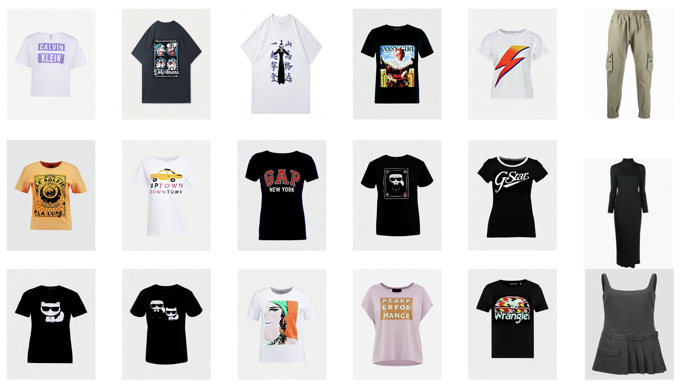

#### IMAGGarment-1: Fine-Grained Garment Generation for Controllable Fashion Design
---
##### Release
---
- [2025/4/16]
---
##### IMAGGarment-1: Controllable Fashion Design

###### Key Part:
1.
2.
3.
##### Dataset Demo

##### Examples
---


<div style="text-align: center;">
  
</div>

##### Introduction
---
IMAGGarment-1 addresses the challenges of multi-conditional controllability in personalized fashion design and digital apparel applications. Speciffcally, IMAGGarment-1 employs a two-stage training strategy to separately model global appearance and local details, while enabling uniffed and controllable generation through end-to-end inference. In the ffrst stage, we propose a global appearance model that jointly encodes silhouette and color using a mixed attention module and a color adapter. In the second stage, we present a local enhancement model with an adaptive appearance-aware module to inject user-deffned logos and spatial constraints, enabling accurate placement and visual consistency. 

##### Requirements
---
- Python>=3.8
- [PyTorch>=2.0.0](https://pytorch.org/)
- cuda>=11.8
```
conda create --name IMAGGarment python=3.8.8
conda activate IMAGGarment
pip install -U pip

# Install requirements
pip install -r requirements.txt
```
##### Download Models
---
You can download our models from  [百度云](). You can download the other component models from the original repository, as follows.
- stabilityai/sd-vae-ft-mse(https://huggingface.co/stabilityai/sd-vae-ft-mse)
- if train: [stable-diffusion-v1-5/stable-diffusion-v1-5](https://huggingface.co/stable-diffusion-v1-5/stable-diffusion-v1-5), if test: [SG161222/Realistic_Vision_V4.0_noVAE](https://huggingface.co/SG161222/Realistic_Vision_V4.0_noVAE)
- [h94/IP-Adapter](https://huggingface.co/h94/IP-Adapter)
- [stable-diffusion-v1-5/stable-diffusion-inpainting](https://huggingface.co/stable-diffusion-v1-5/stable-diffusion-inpainting)

##### How to train
```
# Please download the GarmentBench data first 
# and modify the path in train_color_adapter.sh, train_stage1.sh and train_stage2.sh
# train color adapter
sh train_color_adapter.sh
# train stage1 model
sh train_stage1.sh
# train stage2 model
sh train_stage2.sh
```
##### How to test
```
python inference_logo.py \
--stage1_model_ckpt [stage1 checkpoint] \
--stage2_model_ckpt [stage2 chekcpoint] \
--sketch_path [your sketch path] \
--logo_path [your logo path] \
--mask_path [your mask path] \
--color_path [your color path] \
--prompt [your prompt] \
--output_path [your save path] \
--ip_ckpt [color adapter checkpoint] \
--device [your device]
```
##### Acknowledgement
We would like to thank the contributors to the [IMAGDressing](https://github.com/muzishen/IMAGDressing),[IP-Adapter](https://github.com/tencent-ailab/IP-Adapter) and [CatVTON](https://github.com/Zheng-Chong/CatVTON) repositories, for their open research and exploration.