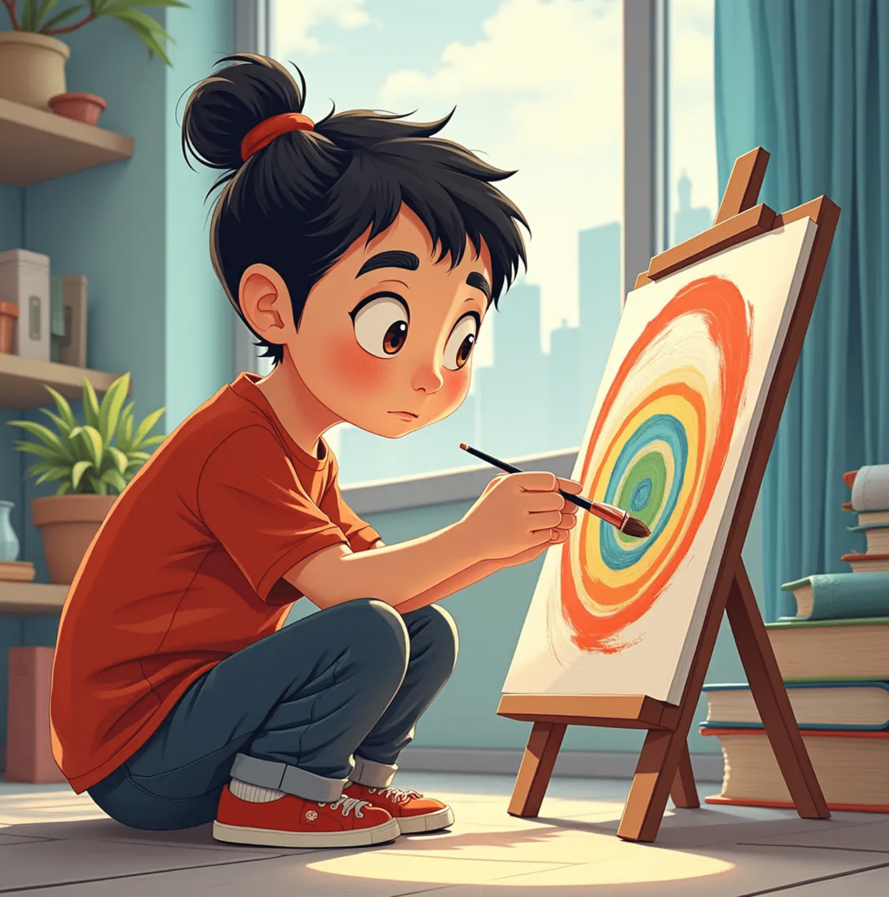
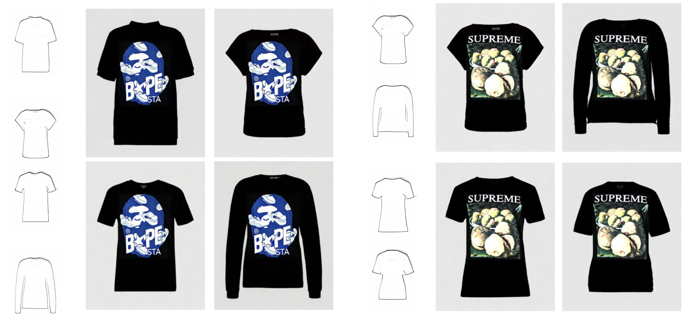
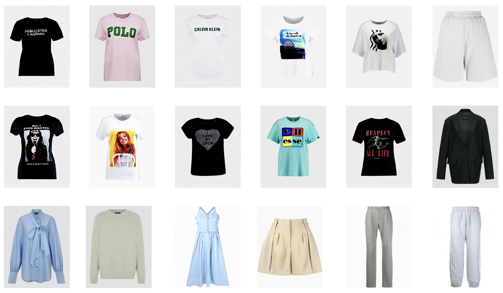

# IMAGGarment-1: Fine-Grained Garment Generation for Controllable Fashion Design

## 🗓️ Release

- [2025/4/17] 🎉 We release the train and inference code of IMAGGarment-1.

## 💡 Introduction
IMAGGarment-1 addresses the challenges of multi-conditional controllability in personalized fashion design and digital apparel applications.
Specifically, IMAGGarment-1 employs a two-stage training strategy to separately model global appearance and local details, while enabling unified and controllable generation through end-to-end inference.
In the first stage, we propose a global appearance model that jointly encodes silhouette and color using a mixed attention module and a color adapter.
In the second stage, we present a local enhancement model with an adaptive appearance-aware module to inject user-defined logos and spatial constraints, enabling accurate placement and visual consistency.


## 🚀 Dataset Demo


## 🚀 Examples


### Different Colors and Silhouettes
<p align="center">
  
</p>

<p align="center">
  
</p>


### More Results
<p align="center">
  
</p>

<p align="center">
  
</p>


## 🔧 Requirements

- Python>=3.8
- [PyTorch>=2.0.0](https://pytorch.org/)
- cuda>=11.8
```
conda create --name IMAGGarment python=3.8.8
conda activate IMAGGarment
pip install -U pip

# Install requirements
pip install -r requirements.txt
```
## 🌐 Download Models

You can download our models from [百度云](https://pan.baidu.com/s/1_nlOTiLqeRYBNb0w0249vQ?pwd=ky3q#list/path=%2F). You can download the other component models from the original repository, as follows.
- stabilityai/sd-vae-ft-mse(https://huggingface.co/stabilityai/sd-vae-ft-mse)
- if train: [stable-diffusion-v1-5/stable-diffusion-v1-5](https://huggingface.co/stable-diffusion-v1-5/stable-diffusion-v1-5), if test: [SG161222/Realistic_Vision_V4.0_noVAE](https://huggingface.co/SG161222/Realistic_Vision_V4.0_noVAE)
- [h94/IP-Adapter](https://huggingface.co/h94/IP-Adapter)
- [stable-diffusion-v1-5/stable-diffusion-inpainting](https://huggingface.co/stable-diffusion-v1-5/stable-diffusion-inpainting)

## 🚀 How to train
```
# Please download the GarmentBench data first 
# and modify the path in train_color_adapter.sh, train_stage1.sh and train_stage2.sh

# train color adapter
sh train_color_adapter.sh
# Once training of color adapter is complete, you can convert the weights into the desired format.
python change.py

# train GAM model
sh train_GAM.sh
# train LEM model
sh train_LEM.sh
```
## 🚀 How to test
```
python inference_logo.py \
--GAM_model_ckpt [GAM checkpoint] \
--LEM_model_ckpt [LEM chekcpoint] \
--sketch_path [your sketch path] \
--logo_path [your logo path] \
--mask_path [your mask path] \
--color_path [your color path] \
--prompt [your prompt] \
--output_path [your save path] \
--color_ckpt [color adapter checkpoint] \
--device [your device]
```
## Acknowledgement
We would like to thank the contributors to the [IMAGDressing](https://github.com/muzishen/IMAGDressing),[IP-Adapter](https://github.com/tencent-ailab/IP-Adapter) and [CatVTON](https://github.com/Zheng-Chong/CatVTON) repositories, for their open research and exploration.

The IMAGGarment code is available for both academic and commercial use. Users are permitted to generate images using this tool, provided they comply with local laws and exercise responsible use. The developers disclaim all liability for any misuse or unlawful activity by users.
## Citation
If you find IMAGDressing-v1 useful for your research and applications, please cite using this BibTeX:

```bibtex
@article{shen2025IMAGGarment-1,
  title={IMAGGarment-1: Fine-Grained Garment Generation for Controllable Fashion Design},
  author={Shen, Fei and Yu, Jian and Wang, Cong and Jiang, Xin and Du, Xiaoyu and Tang, Jinhui},
  booktitle={arXiv preprint arXiv:2504.13176},
  year={2024}
}
```
## 🕒 TODO List
- [x] Paper
- [x] Train Code
- [x] Inference Code
- [ ] GarmentBench Dataset
- [x] Model Weights
- [ ] Upgraded Version for High-resolution Images
## 📨 Contact
If you have any questions, please feel free to contact with us at shenfei140721@126.com, jianyu@njust.edu.cn.
